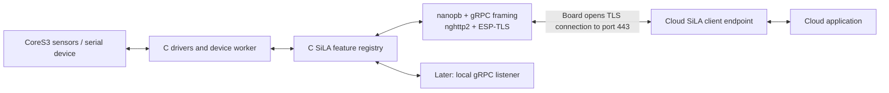

# Epsilan: exploring SiLA 2 on an ESP32-S3

Research date: 16 September 2026. Status: feasibility assessment and proposed architecture; no firmware or hardware validation yet.

**Recommendation:** build a small C SiLA runtime on ESP-IDF, initially exercising SiLA's server-initiated cloud connection. Reuse an existing HTTP/2 implementation, generate bounded protobuf codecs, and implement a deliberately small feature set. Add a local gRPC listener in the next stage. The evidence supports this direction, but actual memory use and gateway interoperability must be measured.

**Working assumptions**

- Hardware is the full M5Stack CoreS3, continuously powered, on 2.4 GHz Wi-Fi.
- One cloud endpoint, eight initial subscriptions, modest sensor publication rates, and one serial device per board.
- All project runtime code is C. Build-time generators may use Python. Normal ESP-IDF toolchain/vendor binary dependencies are acceptable; this is not a claim that every linked vendor component is inspectable C source.
- A development cloud endpoint can accept the standard SiLA reverse connection. Its authentication policy still needs confirmation.
- Initial features use small scalar/structured values and bounded command parameters. Camera, audio streaming, arbitrary bulk binary transfer, and generic runtime loading of feature definitions are deferred.
- This stage is research. The next stage is an interoperability experiment, not a production release.

**What Silaphone already gives us**

I inspected the local source under `/Users/nadim/Repos/nadim/Silaphone`, including the cloud transport, envelope codec, dispatcher, call registry, sensor definitions, and cloud tests.

| Existing implementation | Useful design to retain |
|---|---|
| [CloudConnection.kt](/Users/nadim/Repos/nadim/Silaphone/app/src/main/java/com/silaphone/sila/cloud/CloudConnection.kt) | One outbound bidirectional RPC, TLS configuration, reconnection with backoff |
| [CloudProto.kt](/Users/nadim/Repos/nadim/Silaphone/app/src/main/java/com/silaphone/sila/cloud/CloudProto.kt) | Request UUIDs, envelope variants, nested feature payloads |
| [CloudRouter.kt](/Users/nadim/Repos/nadim/Silaphone/app/src/main/java/com/silaphone/sila/cloud/CloudRouter.kt) | Routing by fully qualified identifiers; subscriptions and cancellation |
| [SilaCallRegistry.kt](/Users/nadim/Repos/nadim/Silaphone/app/src/main/java/com/silaphone/sila/SilaCallRegistry.kt) | A common handler registry shared by local and cloud transports |
| [SensorFeature.kt](/Users/nadim/Repos/nadim/Silaphone/app/src/main/java/com/silaphone/sila/SensorFeature.kt) | FDL definitions, types, units, and observable-property shapes |
| [CloudConnectionE2eTest.kt](/Users/nadim/Repos/nadim/Silaphone/app/src/test/java/com/silaphone/sila/cloud/CloudConnectionE2eTest.kt) | A useful fake-gateway scenario for reads, commands, and reconnection |

The cloud router currently handles unobservable commands, unobservable property reads, observable property subscriptions, and cancellation. It explicitly rejects observable commands and binary transfer. That makes it a useful bounded starting point, but printing jobs will eventually need richer command handling. It also ignores incoming command metadata; an embedded implementation should validate metadata according to its supported features instead of inheriting this shortcut.

The test uses an in-process fake gateway and explicitly excludes sockets/TLS. Its existence does not establish interoperability with a real gateway. I did not run the Android tests.

The README is also behind the code: it describes plaintext LAN service, whereas `SilaServer.start()` now requires TLS credentials and installs an authentication interceptor. Use the code as architectural evidence; verify behavior against the standard independently. I found no registration of `ConnectionConfigurationService` in the inspected implementation.

**The useful role reversal**

The board remains the instrument/SiLA server while acting as a gRPC transport client. It opens `CloudClientEndpoint/ConnectSiLAServer`; requests and responses travel in envelopes over that bidirectional stream. This mapping is specified in [SiLA Part B, pp. 17–21](https://sila-standard.com/wp-content/uploads/2022/03/SiLA-2-Part-B-Mapping-Specification-v1.1.pdf).

An ordinary gRPC client cannot simply receive this reverse connection. The cloud needs to implement the endpoint. If existing applications expect a conventional SiLA server endpoint, the cloud additionally needs a forwarding adapter; that is separate from establishing the reverse stream.

There is a conformance boundary: Part A requires client-initiated connection support, mandates `SiLAService`, and requires `ConnectionConfigurationService` for version 1.1. Feature sets remain fixed during a server lifetime. Therefore an outbound-only first milestone should be described as an experimental subset, not a fully conformant server. [SiLA Part A, pp. 31–33 and 80](https://sila-standard.com/wp-content/uploads/2022/03/SiLA-2-Part-A-Overview-Concepts-and-Core-Specification-v1.1.pdf)

**Implementation options**

| Approach | Consequence | Assessment |
|---|---|---|
| C SiLA runtime; reverse stream first; local listener next | Native SiLA messages on the board, bounded implementation effort | Recommended |
| Local and cloud gRPC from day one | Two transport roles, certificate provisioning, discovery, and more concurrency to debug together | Plausible second milestone |
| ESPHome/MQTT device plus a cloud SiLA adapter | Simpler device software; SiLA implementation resides in the adapter | Useful fallback if hardware measurements reject the native design |

**A reduced implementation of the real wire protocol**

| Layer | Candidate | What we would build |
|---|---|---|
| Scheduling, network, persistence | ESP-IDF / FreeRTOS / lwIP / NVS | Configuration and bounded task/queue ownership |
| TLS | ESP-TLS | Endpoint identity, CA trust, ALPN `h2`, device authentication policy |
| HTTP/2 | Espressif `nghttp`, using libnghttp2 | Socket integration and controlled resource limits |
| gRPC | Small project-owned C layer | Message framing, method headers, status/trailers, stream lifetime |
| Protobuf | nanopb | Generated codecs and size limits from pinned schemas |
| SiLA | Project-owned C layer | Feature registry, UUID correlation, subscriptions, errors and commands |
| Board | Espressif CoreS3 BSP plus focused C drivers | Hardware initialization and feature adapters |

Espressif publishes the [nghttp C component](https://components.espressif.com/components/espressif/nghttp/versions/1.69.0/readme). Its [sh2lib component](https://components.espressif.com/components/espressif/sh2lib/versions/1.1.0/readme) combines nghttp2 and ESP-TLS; treat that as a starting example, subject to checking access to trailers, flow control, and indefinite bidirectional bodies. Direct nghttp2 integration is my preferred design if the wrapper obscures those controls. Component versions shown here are research observations, not a tested dependency lock.

[ESP-TLS](https://docs.espressif.com/projects/esp-idf/en/stable/esp32s3/api-reference/protocols/esp_tls.html) supports certificate validation, SNI, ALPN, and nonblocking connections. [Nanopb](https://jpa.kapsi.fi/nanopb/docs/concepts.html) supports static field limits and callback-based streaming. Its runtime is suitable for C; code generation runs on the development machine.

The gRPC layer must handle its five-byte message prefix, messages fragmented across HTTP/2 DATA frames, several messages in one frame, headers, and terminal status trailers. An HTTP 200 response alone does not establish RPC success. Start with uncompressed messages and reject unsupported compression explicitly. [gRPC wire specification](https://github.com/grpc/grpc/blob/master/doc/PROTOCOL-HTTP2.md)

We should let nghttp2 implement HTTP/2 and HPACK. Our adapter must service reads and writes while idle, respect backpressure, and distinguish HTTP/2 connection failure from an individual SiLA request error. A quiet outbound queue must not close the request body: nghttp2 supports deferring the data provider and resuming it when data arrives. [nghttp2 API](https://nghttp2.org/documentation/nghttp2.h.html)

Proposed runtime structure:

- One network task owns TLS, the HTTP/2 session, and stream writes.
- Sensor tasks update cached typed values. A dispatcher manages a fixed subscription table.
- A serial worker owns UART transactions and timeouts. It returns completion asynchronously to the dispatcher.
- Command replies get priority over periodic telemetry. Sensor values may be coalesced under backpressure; barcode events must use a separate queue.
- Reconnect clears transport subscriptions and requires resubscription. Accepted device jobs have a separate lifetime and are not automatically re-executed after reconnect.
- Keep FDL XML in flash. Generate codecs and dispatch tables at build time, rather than parsing feature XML on the board. Stream larger FDL responses without constructing multiple nested copies.

Fetch and pin the official cloud/framework/feature schemas before generating C. The [canonical protobuf directory](https://gitlab.com/SiLA2/sila_base/-/tree/master/protobuf) was located, but the raw cloud schema was not readable through the tools in this session. The protocol mapping was checked in Part B and compared with Silaphone source; exact schema field-by-field verification remains a first implementation task.

**CoreS3 starting features**

The full CoreS3 has 16 MB flash, 8 MB PSRAM, BMI270 motion sensing, BMM150 magnetometer, LTR-553 light/proximity sensing, a display, speaker, and power-management hardware. The SE omits the motion, magnetic, light/proximity, and camera hardware. Confirm the actual board revision; M5Stack also records a recent LCD-controller revision. [CoreS3 documentation](https://docs.m5stack.com/en/core/CoreS3)

| Proposed feature | Interface | Initial priority |
|---|---|---|
| SiLAService | Identity, implemented features, FDL retrieval, server naming | First |
| Accelerometer | Observable X/Y/Z acceleration in m/s² | First |
| DisplayControl | `SetBacklight(Level)` plus current setting | First actuator |
| LightSensor | Observable ambient light after validating conversion to lux | Next |
| Gyroscope | Observable X/Y/Z angular rate in rad/s | Next |
| DeviceHealth | Uptime, firmware version, connection state, queue/heap diagnostics | Next |
| AlarmSpeaker | Bounded tone command | Optional |
| ConnectionConfigurationService | Standard connection configuration | Conformance stage |

These feature names beyond the standard core services are proposals, not claims that corresponding standardized FDLs exist. Reuse Silaphone FDLs only where semantics and identifiers match; otherwise create versioned project features. Do not expose an IMU's chip temperature as ambient temperature, or raw optical proximity counts as calibrated distance.

There is an [Espressif CoreS3 BSP](https://github.com/espressif/esp-bsp/tree/master/bsp/m5stack_core_s3), with a [C entry-point tutorial](https://docs.m5stack.com/en/esp_idf/m5cores3/bsp). Investigate its exact driver/dependency coverage first. [Bosch's BMI270 SensorAPI](https://github.com/boschsensortec/BMI270_SensorAPI) is another C driver option. Board power rails and IO-expander initialization must be correct before sensor reads. M5Unified is a useful hardware reference, but its C++ API is outside the proposed strict-C runtime.

**Provisional resource envelope**

The following are engineering starting limits, not measurements or SiLA-wide limits:

| Resource | Initial target |
|---|---|
| Cloud sessions / reverse RPCs | 1 / 1 |
| Active subscriptions | 8 |
| Sensor publication | 1–10 Hz per exposed property |
| Concurrent serial transactions | 1; a small bounded pending queue |
| Incoming application envelope | 16 KiB cap, checked before allocating payload storage |
| Outgoing FDL envelope | Up to 64 KiB initially, encoded incrementally; verify actual generated sizes |
| Barcode backlog | 64 records; 256 bytes of text per record initially |
| Print input | Small template parameters first; no raster job spool in the initial build |

At eight subscriptions × 10 updates/s × an assumed 200 encoded bytes/update, traffic would be about 16 kB/s before HTTP/2/TLS overhead. That suggests transport throughput is unlikely to be the first bottleneck; it is not a measured board result.

Measure internal heap separately from PSRAM, including largest free block, minimum free heap, per-task stack high-water marks, and TLS handshake peak. PSRAM is useful for buffers but does not remove internal-memory constraints; DMA descriptors and default task stacks have restrictions. Flash activity also affects PSRAM access. [ESP-IDF external RAM guidance](https://docs.espressif.com/projects/esp-idf/en/stable/esp32s3/api-guides/external-ram.html)

Define an internal-heap acceptance margin after the first baseline; a tentative target is at least 64 KiB spare during the tested workload, with enough contiguous space for the largest measured allocation. Test reconnect and OTA peaks, not only steady state. If OTA needs another TLS session, deliberately pause the instrument connection or budget for both.

**Serial devices: expose useful behavior**

Start with one known UART/RS-232 scanner or printer and its protocol manual. Do not assume that every connector called serial is electrically compatible. A board GPIO UART needs the correct RS-232/RS-485 transceiver or level conversion. Confirm connector pinout, flow control, and peripheral power separately. ESP-IDF supplies buffered UART APIs and flow-control support. [UART documentation](https://docs.espressif.com/projects/esp-idf/en/stable/esp32s3/api-reference/peripherals/uart.html)

For scanners, propose `LastScan = {Sequence, Barcode, Timestamp, Quality}` plus a bounded retained-event API such as `ReadScansAfter(Sequence, Limit)`. Two identical successive barcodes must remain two scans. A changing sequence makes the live property useful, but property observation alone does not promise lossless event delivery. Define boot/session identifiers, queue overflow reporting, and acknowledgement rules. RAM retention is adequate for a demo; disconnected operation across power loss requires a durable journal.

For printers, expose `PrintLabel(Template, Fields, JobId)` and job status. Start with text/templates understood by one printer model. Add observable-command execution for longer jobs. Distinguish queued, bytes transmitted, device acknowledged, and physically printed where the printer actually reports those states. A successful UART write cannot prove that paper emerged.

Use an application job identifier with deduplication; the cloud request UUID correlates protocol messages and is not by itself a durable exactly-once guarantee. On connection loss, do not blindly resend a print job. If power disappears between printing and recording completion, report an uncertain outcome unless the printer can resolve it. Serialize access to each physical device and validate bounded input before issuing side effects.

USB is a later branch. ESP32-S3 has host support and Espressif provides HID and CDC-ACM examples, but scanners may be HID keyboards, CDC devices, or vendor-specific devices; printers may need another class driver. Confirm the model and board VBUS/OTG arrangement before choosing that route. [ESP USB host documentation](https://docs.espressif.com/projects/esp-usb/en/latest/esp32s3/usb_host.html)

**Lifecycle and ESPHome**

Keep a small C library with an explicit platform interface for transport, clock, persistence, and hardware. That gives us two later packaging choices:

| Choice | Language consequence | Lifecycle approach |
|---|---|---|
| ESP-IDF firmware | Project runtime remains C | Provisioning, signed firmware, staged rollout, diagnostics, A/B OTA and rollback |
| ESPHome external component | C SiLA core plus C++ wrapper | ESPHome configuration/build ecosystem and its update mechanisms |

ESPHome components generate and use C++; using the ESP-IDF backend does not make ESPHome itself a C framework. Its [component architecture](https://developers.esphome.io/architecture/components/) and [external-component mechanism](https://esphome.io/components/external_components/) make the wrapper route plausible, subject to a separate integration experiment.

ESPHome also documents [device-pulled HTTP OTA](https://esphome.io/components/ota/http_request/) and [manifest-based managed updates](https://esphome.io/components/update/http_request/). These do not automatically manage an unrelated ESP-IDF binary. For the C version, use [ESP-IDF OTA and rollback](https://docs.espressif.com/projects/esp-idf/en/stable/esp32s3/api-reference/system/ota.html) and build an ESPHome-like provisioning/build/deployment workflow around it.

Reserve update partitions early; keep persistent UUID, endpoint settings, credentials, and configuration schema version outside the application image. Include local recovery and a bounded boot health check. Coordinate upgrades with serial jobs. Device identity must be authenticated by credentials or a verified provisioning policy: a public UUID is identification, not a secret. Confirm whether the intended gateway uses mTLS, tokens, or another enrollment mechanism. Preserve certificate validation and bootstrap usable time before certificate checks.

**Experiments that would settle feasibility**

1. **Host protocol harness.** Pin official schemas, generate nanopb codecs, and compare decoded messages with an independent generated implementation. Exercise real UUIDs, SiLA wrappers, defaults, oneofs, malformed/oversized messages, FDL responses, subscription cancellation, and per-request errors.
2. **Real network reverse stream.** Run a small test CloudClientEndpoint using a normal gRPC implementation. Prove simultaneous read/write, idle stream survival, trailer handling, flow-control stalls, fragmented/coalesced messages, and reconnect over TLS. This harness can use Python even though the device runtime remains C.
3. **CoreS3 vertical slice.** Board connects outward, answers identity/FDL requests, publishes acceleration, and responds to `SetBacklight`. Record image size, internal/PSRAM usage, handshake peak, stack margins, and round-trip behavior. Then try the intended cloud gateway.
4. **Failure and soak test.** At least 24 hours with repeated Wi-Fi loss, gateway restarts, slow consumer, cancellation storms, invalid certificates, and exhausted queues. Require bounded memory and no unintended repeated actuation.
5. **Local SiLA interface.** Add a small TLS gRPC server using the same registry, discovery, standard connection configuration, and independent-client interoperability checks. Review conformance requirements systematically before making a compliance claim.
6. **Serial vertical slice.** One documented scanner or printer; test repeated identical scans or printing with disconnect during completion. Expand only after semantics are correct.
7. **Lifecycle experiment.** Signed OTA, power interruption, rollback, stable identity/configuration, and eventually an optional ESPHome wrapper.

The main open questions are the precise CoreS3 revision, target gateway authentication/stream limits, the first serial device's physical/protocol interface, and measured memory under TLS plus OTA. None prevents starting the host harness. Firmware implementation and a compliance claim should wait for the corresponding evidence.
